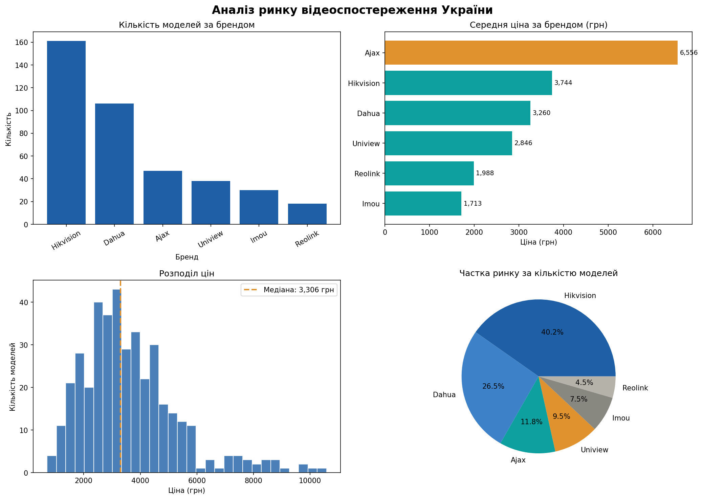

# 📊 Аналіз ринку відеоспостереження (навчальний проєкт)

[](https://python.org)
[](https://pandas.pydata.org)
[]()

> ⚠️ **Про дані.** Датасет у цьому проєкті **синтетичний** — згенерований програмно (NumPy), а не зібраний з реальних магазинів. Спершу я намагався зібрати реальні дані з Rozetka та Hotline, але збір заблокував анти-бот захист (статуси 404/403). Щоб усе одно продемонструвати повний цикл аналізу, я згенерував реалістичний датасет на 400 моделей камер. **Усі цифри нижче стосуються згенерованих даних, а не реального ринку.**

## 🎯 Мета проєкту

Продемонструвати повний робочий цикл аналітика на навчальному прикладі:
спроба збору реальних даних → генерація реалістичного датасету → очищення → EDA → візуалізація → висновки.

## 🛠 Технології

- **Python 3.14**
- **Pandas** — обробка та аналіз даних
- **NumPy** — генерація синтетичного датасету
- **Matplotlib** — візуалізація
- **Requests / BeautifulSoup** — спроби збору реальних даних (скрапінг)

## 📈 Результати аналізу (на симульованих даних)



> Нагадування: це властивості **згенерованого** датасету, а не реального ринку.

- **Hikvision** — найбільша частка за кількістю моделей (40.2%)
- **Ajax** — найдорожчий сегмент (середня ціна 6 556 грн)
- **Imou** — найбюджетніший (середня ціна 1 713 грн)
- Медіана цін: **3 306 грн**
- 81% моделей позначені як «в наявності»

## 📁 Структура проєкту

```
camera-market-analysis/
├── notebooks/
│   └── 01_scraping.ipynb    # спроби скрапінгу + генерація + EDA
├── data/
│   └── cameras_ukraine.csv  # синтетичний датасет (400 записів)
├── images/
│   └── eda_overview.png     # графіки
└── report.txt               # текстовий звіт
```

## 👤 Автор

**Maksym** — Aspiring Data Analyst. Навчаюсь у GoIT | Python, SQL, Pandas
